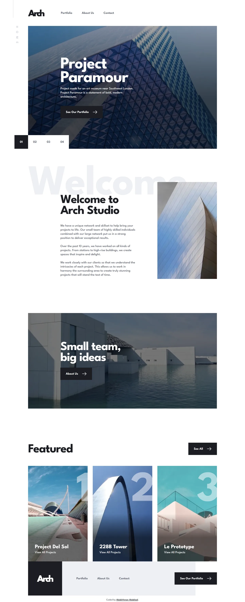

# Arch Studio multi-page website

My solution to the [Arch Studio multi-page website](https://www.frontendmentor.io/challenges/arch-studio-multipage-website-wNIbOFYR6)
challenge on Frontend Mentor.

- Live: https://arch-studio-multi-page-website.abdelrhman-ahmed8881.workers.dev
- Code: https://github.com/MrBlackvanta/arch-studio-multi-page-website

## Built with

- Next.js 16, App Router, static export
- React 19 and TypeScript
- Tailwind CSS v4

## Notes

### Colour and contrast

Four changes, all forced by AA. Ratios come from compositing the real photo pixels under each
text box, not from the flat hex values, because three of the four sit on images.

|                                        | design                  | built                                  | contrast     |
| -------------------------------------- | ----------------------- | -------------------------------------- | ------------ |
| Contact field label                    | `#C8CCD8`               | `#60636D`, the body grey               | 1.60 to 5.99 |
| Contact label and message, error state | `#EFAAAA` and `#DF5656` | `#DA3A3A` for both                     | 3.75 to 4.52 |
| Hero photo scrim                       | flat black at 35%       | 35% ramping to 70%, then held          | from 2.43    |
| Project card scrim and its date        | 0 to 50%, date at 75%   | 0 to 60% by the midpoint, date at 100% | 2.19 to 4.95 |

The two scrims are the interesting ones. A gradient's endpoint alpha is not the alpha under the
caption, so quoting the endpoint tells you nothing. What matters is the value where the text
actually sits, and the worst case is a caption that wraps onto a second line and climbs into the
lighter part of the ramp. Both scrims ramp and then hold flat, so a wrapped caption can't outrun
the dark part.

The error state keeps the design's `#DF5656` on the 1px rule, which only has to clear 3:1 as a
boundary.

**The ghost watermarks and the vertical page rail are CSS generated content**, via a `data-`
attribute and `content: attr()`. They're pure decoration at 1.14:1 and 1.6:1, already
`aria-hidden`, and WCAG 1.4.3 exempts decorative text from contrast outright. But axe judges what
was rendered rather than what was intended, ignores `aria-hidden` for its contrast rule, and
flagged all three. It cost 4 accessibility points on every route and only on desktop, because all
three are `md:block`.

Darkening wasn't an option: the lightest grey that clears 3:1 is a mid grey, and a watermark at
3:1 isn't a watermark any more. Moving the decoration into CSS puts it where decoration belongs
and axe stops evaluating it. Using `attr()` rather than a literal keeps the word in `src/data` as
its single source. The pseudo-element inherits font, size, colour, tracking and `writing-mode`, so
the rendered geometry is unchanged, which I checked against the rail's own glyph heights.

A focus ring exists throughout where the design draws none. The exception is the contact fields,
whose 1px to 3px rule is the design's own focus state and already carries the indicator.

### Where the design frames disagree with each other

- **The About hero panel bleeds to the right edge at every width from 768 up.** It reaches 1440
  exactly on desktop but stops 41px short on tablet. A panel that almost reaches the edge reads as
  a mistake at every viewport that isn't exactly 768.
- **About's desktop `h1` sits at 603, not 587.** The gap from the rule to the heading is 73 in
  three of the four hero instances, so all four use 73, and About and Contact share one component.
- **"View on Map" sits flush to its column.** The design insets it 6px at desktop and mobile and
  right-aligns it at tablet.
- **The 65px section rules sit a pixel left of where Figma puts them**, which draws each one a
  pixel right of the text it belongs to, on every page.
- **The tablet container spans 96 to 672**, against the frame's 97 to 670.
- **The contact field label is indented 34px**, against 34.49. The frame's own three labels
  disagree with each other by half a pixel.
- **The office phone number is the one in all three base frames**, not the different value in the
  Active States frame.

Frontend Mentor's own copy typos are kept as they are.

### Markup and behaviour the design doesn't describe

- **The office addresses are a `<dl>`.** The design tab-aligns label and value inside a single
  text node, with a different number of tabs per breakpoint.
- **Mail and phone are `mailto:` and `tel:` links**, drawn as plain text.
- **Both "View on Map" links carry an `sr-only` office name**, so two links to the same target
  don't share one accessible name. The visible text stays inside the accessible name.
- **The contact form validates on the client and announces the result.** There's no backend and no
  request. An invalid submit marks every failing field, moves focus to the first, and clears them
  as they're fixed; a valid one resets the form and announces success through a live region. The
  design has neither state.
- **The message field grows as you type**, past the design's 92px box, via
  `field-sizing: content`.
- **The mobile menu swaps the hamburger for the close icon** Frontend Mentor ships and the design
  never uses, and marks the current route on every page. Only the Portfolio frame draws that.

### Performance

The hero carousel preloads only the first slide. `fetchPriority="low"` orders a request but never
defers it, so without an explicit `loading="lazy"` the other slides still compete with the LCP
image on the initial load. First slide is `eager` and `high`, the rest are `lazy` and `low`.

`experimental.inlineCss` is on. It's worth measuring per project rather than assuming, since it
trades a stylesheet request for a bigger document and the balance flips depending on how much of
the page is above the fold.

## Author

- [LinkedIn](https://www.linkedin.com/in/abdelrhman-vanta/)
- [UpWork](https://www.upwork.com/freelancers/mrblackvanta)
- [Frontend Mentor](https://www.frontendmentor.io/profile/MrBlackvanta)
